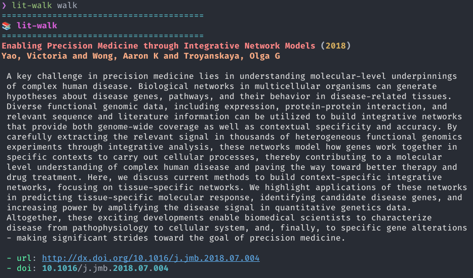
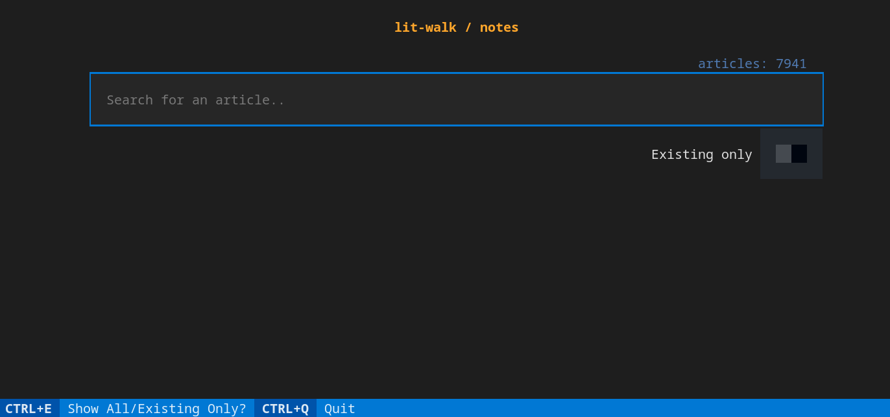

lit-walk
========

**Status (Feb 2023)**: Early development

Overview
--------



_A random walk across the science literature.._

The purpose of this tool is to facilitate exploration and understanding of the scientific
literature:

`lit-walk` supports two main functions:

1. Stochastic literature review
2. Markdown note-taking

At present, `lit-walk` is limited to operating on articles in a user's collection, as exported from
a reference management tool such as [Paperpile](https://paperpile.com/app).

Long-term, the plan is to develop lit-walk into a general-purpose tool for interacting with science
literature data, using sources such as [PubMed](https://pubmed.ncbi.nlm.nih.gov/),
[arXiv](https://arxiv.org/), and [Semantic Scholar](https://www.semanticscholar.org/).

In particular, a major goal is to be able to infer network representations of both the "world", and
the user's own understanding, based on their article collection, and to use the _difference_ between
these two to guide the user towards topics which might represent "gaps" in ones understanding.

Installation
------------

To install `lit-walk`, clone this github repo and use `pip` to install it:

```
git clone https://github.com/lit-explore/lit-walk
cd lit walk
pip install --user .
```

Configuration
-------------

`lit-walk` looks for a configuration file in `$XDG_CONFIG_HOME` on linux (this is
usually `~/.config`), and `$HOME/.lit-walk` otherwise.

At present, `lit-walk` has only been tested on Linux.

The first time you run `lit-walk`, if no configuration file is found in the above
locations, a default one will be created for there.

See the comments in the generated configuration file for an explanation of what each of
the settings relates to.

Usage
-----

To get started, use your reference manager software, or other means, to generate a
[BibTeX](http://www.bibtex.org/) dump of your library, including all articles that you
want `lit-walk` to draw from.

Most reference managers should provide a means to export you article collection as BibTeX.

Next, call `lit-walk add`, and point it to the location where you saved your `.bib`
file:

```
lit-walk add path/to/refs.bib
```

`lit-walk` will parse the bibliography, and generate a sqlite database with the relevant
fields.

To check the status of `lit-walk` database and see how many articles it contains, use
the `info` command:

```
lit-walk info
```

To have `lit-walk` suggest an article, simply call:

```
lit-walk walk
```

`lit-walk` will randomly select an article from your collection, and print the article
_title_, _authors_, _abstract_, _year_, _doi_, and _url_.

Additionally, an entry will be recorded in the `stats` table of `lit-walk` database. In
the future, this will be changed so that the user can decide whether to count the
article in their stats, or not.

To take notes on an article, run:

```
lit-walk notes
```



A [Textual](https://github.com/Textualize/textual)-based TUI will be launched, allowing one to
search through their article collection and select an article to take notes on.

An "existing only" switch can be used to limit search results to only those articles for which notes
already exist.

Once an article is selected, a markdown file named after the note is opened with the user's default
editor (`$EDITOR`).

For new notes, an empty file with the article title is shown. Otherwise, if the user opens a
previously edited note, their existing notes are shown.

To control where notes are stored, you can modify the `notes_dir` config parameter.

It is recommended to keep your notes in a location that is automatically backed up.

Future Plans
------------

Major goals going forward include:

1. Enable support for interacting with articles _outside_ of a user's collection
2. Use [lit-embed](https://github.com/lit-explore/lit-embed) topic models to infer user & "global"
   topic networks, constrained to some search phrase.
  - "walk" can then adopt a biased random walk approach, keeping track of the location within the
     user's topic network and biasing article selection towards recently review topics,
     knowledge gaps, etc.
  - "inverse" searches can then be supported, suggesting topics and articles based on the difference
    between the user's knowledge (using the topical content of their article collection as a rough
    proxy), and the "world" (e.g. PubMed or arXiv), constrained to some topic of interest.
3. Add annotation data
  - [lit-embed](https://github.com/lit-explore/lit-embed) topics
  - [PubTator Central](https://www.ncbi.nlm.nih.gov/research/pubtator) named entities
  - etc.
4. Improve note-taking workflow
  - e.g. group articles by topic/manuscript section via tags, and limit review/note-taking commands
    the specified subsets

Development
-----------

`lit-walk` is still in the early stages of development and testing, and is likely to
change significantly in the future.
